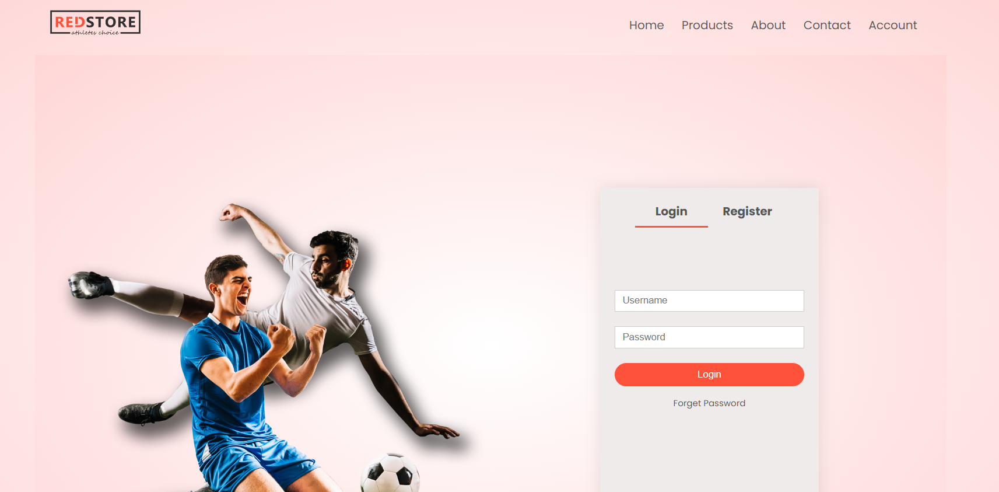
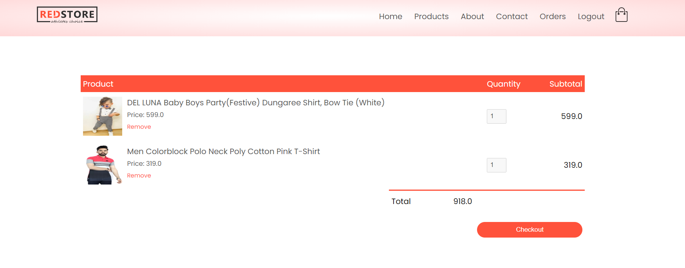

# Ecommerce-Django-Project

## Intuition behind the project
* This project focus to create a E Commerce app
* User can create account, login add prodect, review it and place the order 
* Admin can review each order, change the order status, delete user etc.

## Programming Language used
* Python-Django
* CSS
* JavaScript
* HTML






## How to run the program

* clone the project

   ```bash
https://github.com/be19b028ramshidnk/Ecommerce-Django-Project.git

Enter to the ecart folder
   ```bash
cd ecart

   ```bash
python manage.py runserver